# 智能导游系统程序流程图

## 系统整体架构

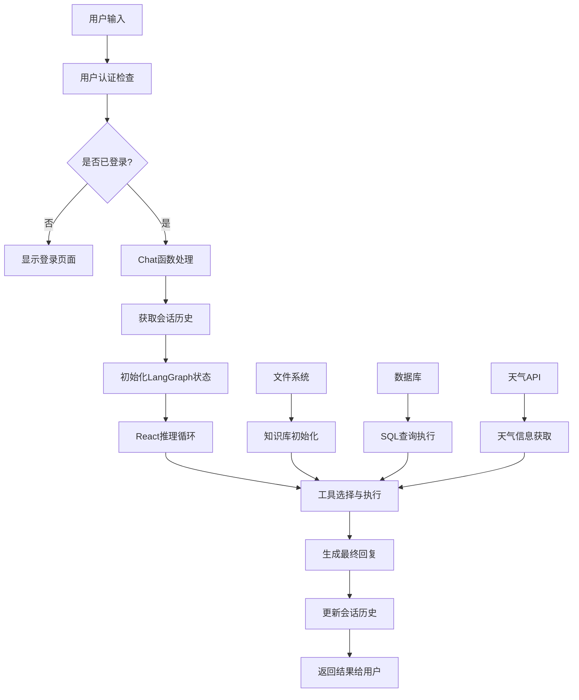

## 核心React推理流程

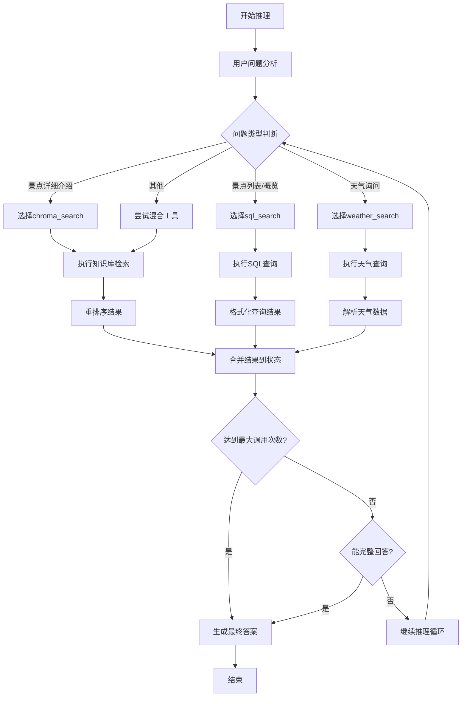

## 知识库检索流程

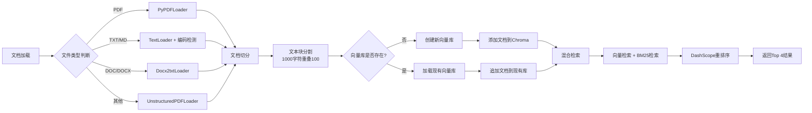

## LangGraph状态流转

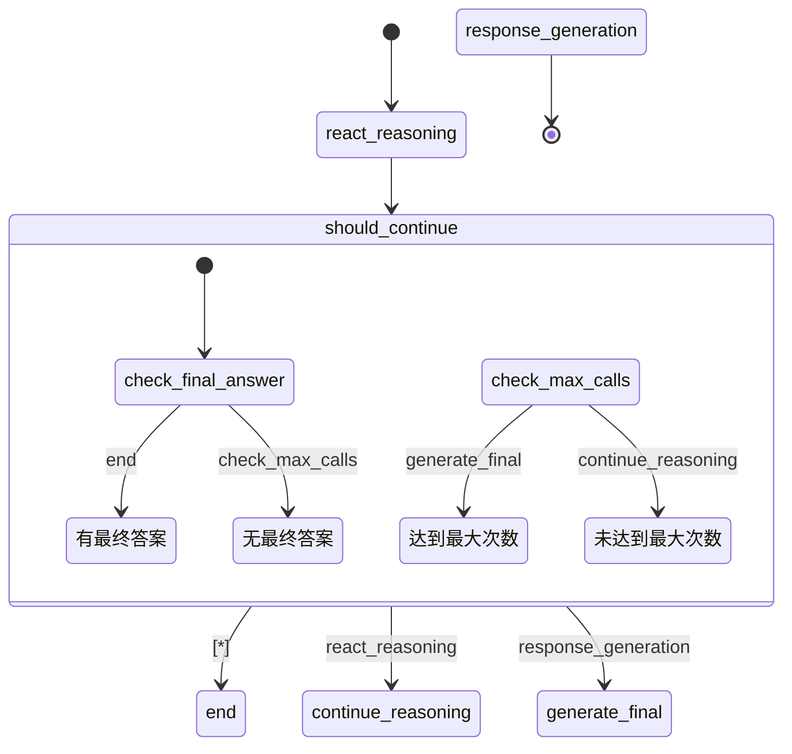

## 数据库交互流程

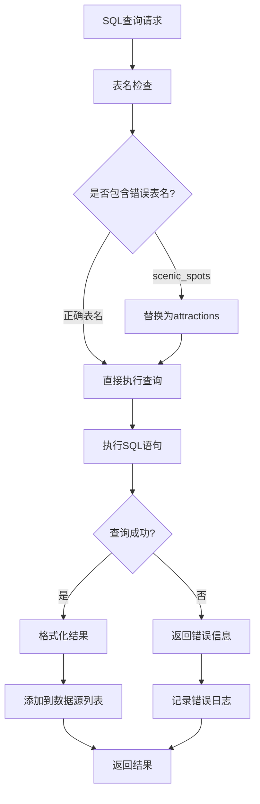

## 天气查询流程

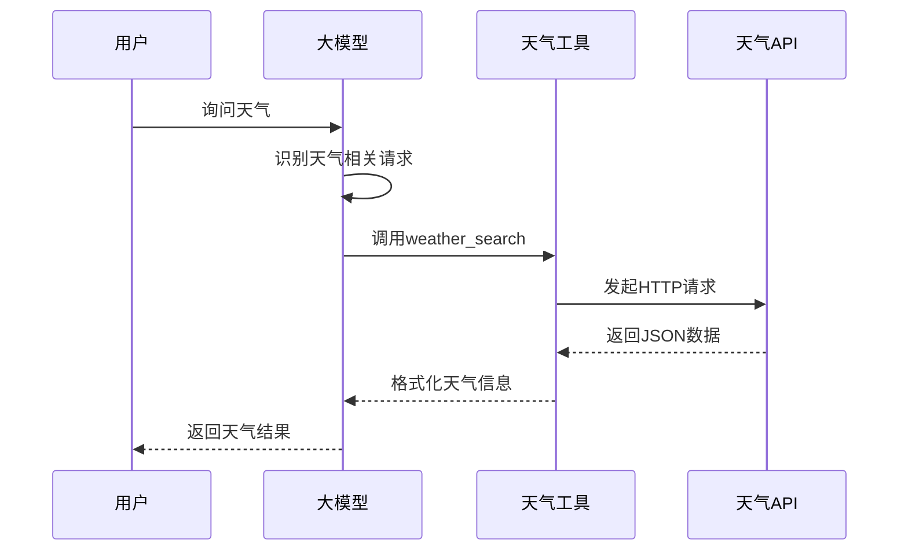

## 系统初始化流程

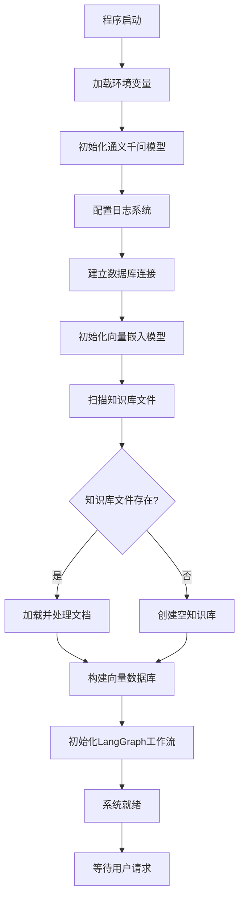

## 错误处理机制

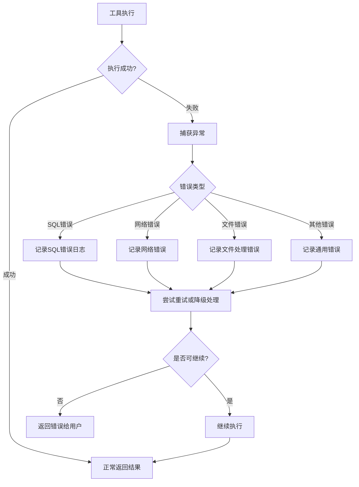

## 主要组件交互图

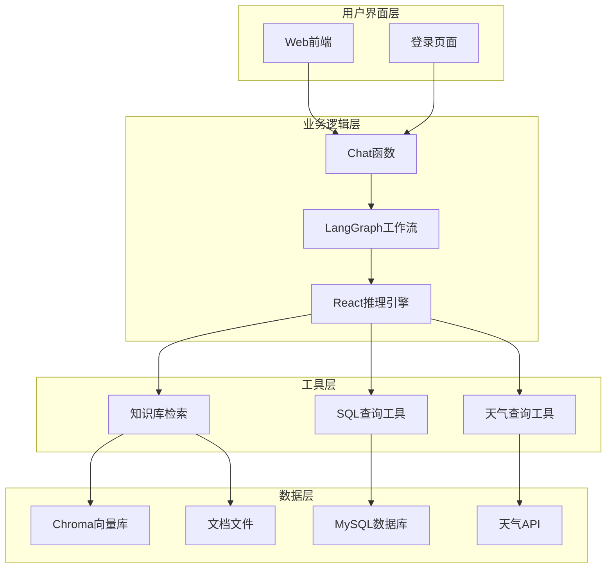

## 关键数据结构

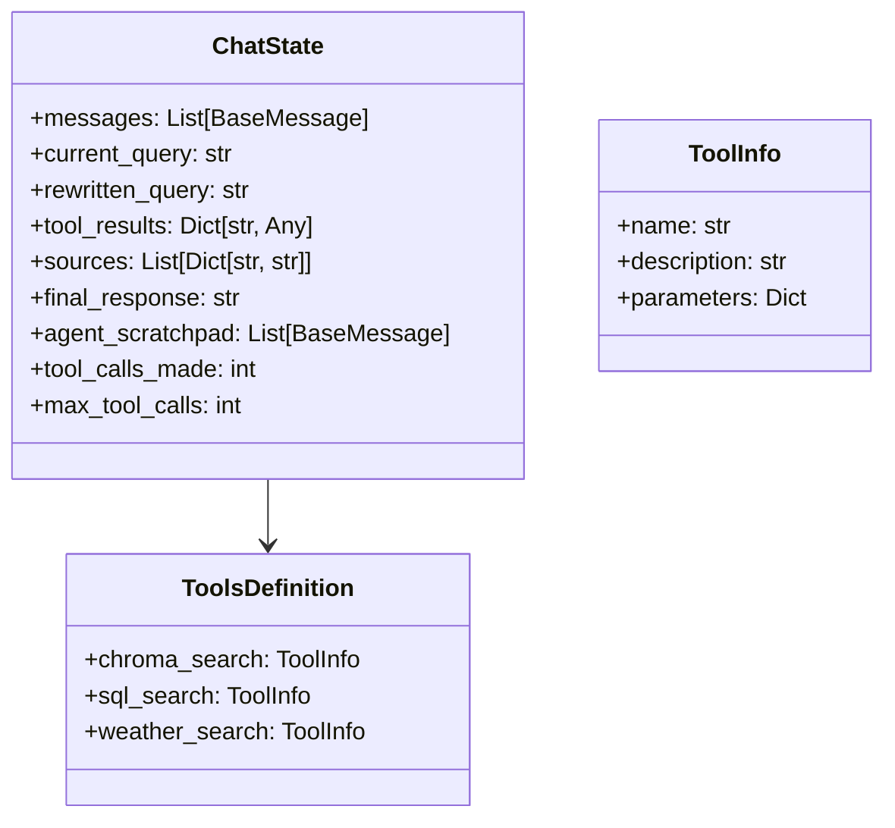

## 程序执行时序

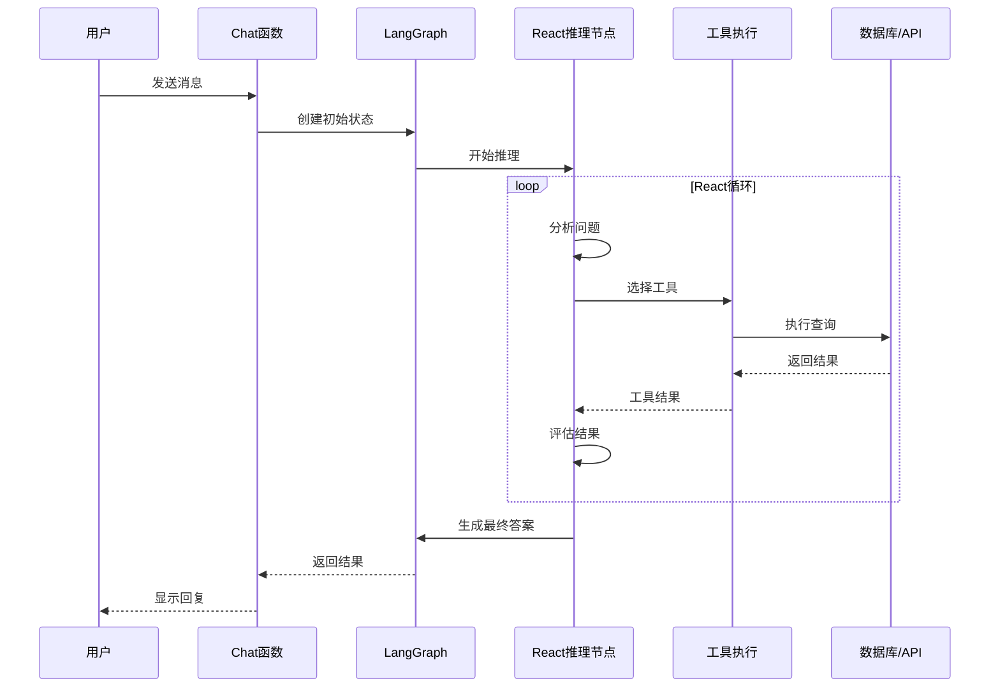

这个流程图涵盖了整个智能导游系统的主要流程，包括用户交互、React推理机制、知识库检索、数据库查询、天气查询等核心功能模块。